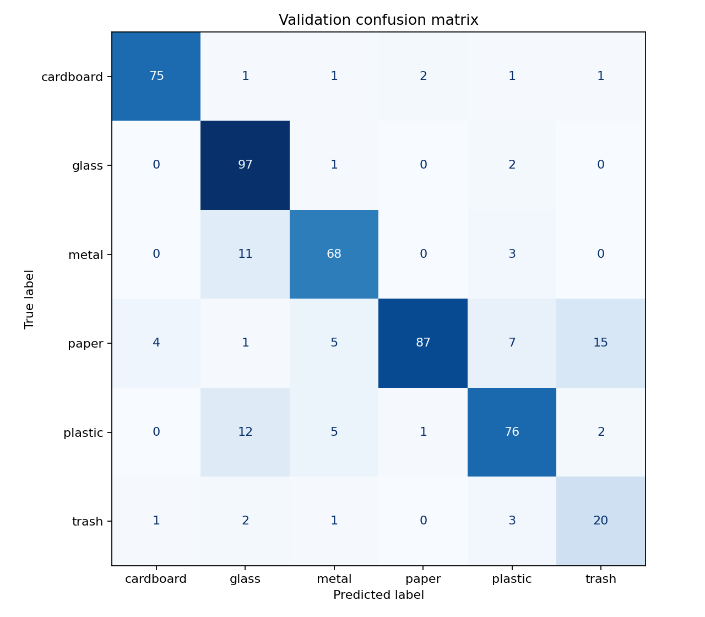
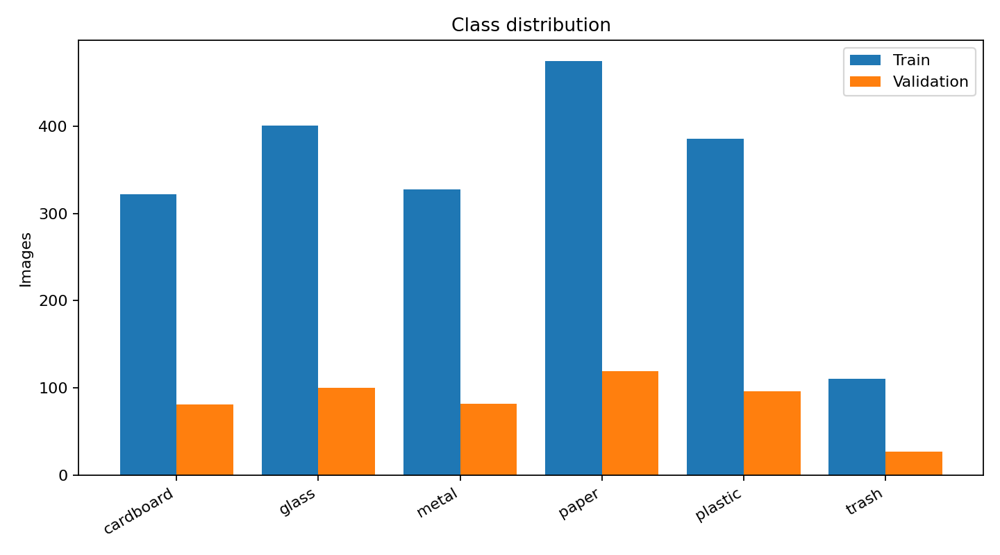
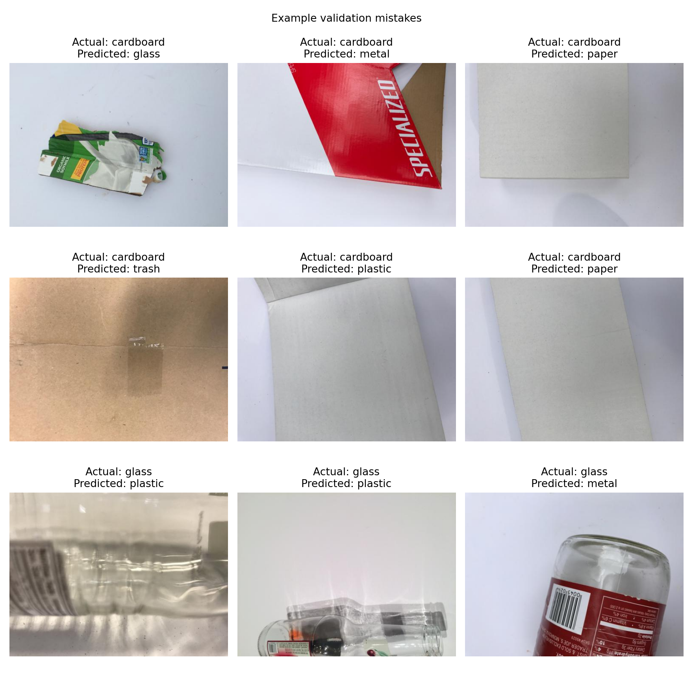

# Trash/Recycle Classifier

An end-to-end image-classification project that identifies six types of waste:
cardboard, glass, metal, paper, plastic, and trash. It uses transfer learning
with an ImageNet-pretrained MobileNetV3 Small model and includes a Streamlit
interface for trying predictions on uploaded images.

The repository includes the trained checkpoint, so the demo works immediately
after installation. The shipped model achieves **83.76% validation accuracy**
and **81.48% macro F1** on 505 validation images.

> The validation set was used to select the best checkpoint. These results are
> useful for model development but are not a substitute for performance on an
> independent test set.

## Results

| Class | Precision | Recall | F1 | Validation images |
|---|---:|---:|---:|---:|
| Cardboard | 93.75% | 92.59% | 93.17% | 81 |
| Glass | 78.23% | 97.00% | 86.61% | 100 |
| Metal | 83.95% | 82.93% | 83.44% | 82 |
| Paper | 96.67% | 73.11% | 83.25% | 119 |
| Plastic | 82.61% | 79.17% | 80.85% | 96 |
| Trash | 52.63% | 74.07% | 61.54% | 27 |
| **Macro average** | **81.31%** | **83.14%** | **81.48%** | **505** |
| **Weighted average** | **85.46%** | **83.76%** | **83.92%** | **505** |

The complete machine-readable report is available in
[`reports/metrics.json`](reports/metrics.json).

### Confusion matrix



### Dataset distribution



### Example mistakes



## Dataset

This project uses [TrashNet](https://github.com/garythung/trashnet), collected
by Gary Thung and Mindy Yang. The original dataset contains 2,527 images across
six classes. Its repository is MIT licensed and requests attribution when the
dataset is used.

| Class | Train | Validation | Total |
|---|---:|---:|---:|
| Cardboard | 322 | 81 | 403 |
| Glass | 401 | 100 | 501 |
| Metal | 328 | 82 | 410 |
| Paper | 475 | 119 | 594 |
| Plastic | 386 | 96 | 482 |
| Trash | 110 | 27 | 137 |
| **Total** | **2,022** | **505** | **2,527** |

The local dataset is arranged as an approximately 80/20 train/validation split.
Images are excluded from this repository. Download TrashNet and organize it as
shown below to retrain the model. Because the exact split file list is not
included, a newly created split may produce slightly different results.

```text
data/
├── train/
│   ├── cardboard/
│   ├── glass/
│   ├── metal/
│   ├── paper/
│   ├── plastic/
│   └── trash/
└── val/
    ├── cardboard/
    ├── glass/
    ├── metal/
    ├── paper/
    ├── plastic/
    └── trash/
```

## Model and training

- MobileNetV3 Small initialized with ImageNet weights
- Frozen convolutional feature extractor and trainable classifier head
- 224 × 224 RGB inputs with ImageNet normalization
- Random horizontal flips, rotations, and color jitter during training
- Adam optimizer with a default learning rate of `1e-3`
- Cross-entropy loss, batch size 32, and 8 epochs by default
- Best checkpoint selected by validation accuracy
- Python, NumPy, PyTorch, CUDA, and DataLoader seeding with default seed 42
- CPU, CUDA, and Apple Silicon MPS support

The committed checkpoint was selected at epoch 8 and has a validation loss of
0.4895. Exact numerical reproducibility can still vary between hardware and
accelerator backends.

## Quick start

Create an environment and install the pinned dependencies:

```bash
python3 -m venv .venv
source .venv/bin/activate
pip install -r requirements.txt
```

Run the included model in Streamlit:

```bash
PYTHONPATH=src streamlit run app.py
```

Open the local URL printed by Streamlit, usually `http://localhost:8501`, and
upload a JPG, PNG, or WebP image. The app displays the predicted class,
confidence, and full probability distribution.

## Retraining and evaluation

After preparing `data/train` and `data/val`, run:

```bash
PYTHONPATH=src python train.py --epochs 8 --seed 42
```

Useful options include:

```bash
PYTHONPATH=src python train.py \
  --data-dir data \
  --model-path models/mobilenetv3_small_recycle.pth \
  --reports-dir reports \
  --epochs 8 \
  --batch-size 32 \
  --learning-rate 0.001 \
  --num-workers 2 \
  --seed 42
```

Training saves the best checkpoint and then reloads it to create:

- `reports/metrics.json` — loss, accuracy, and per-class metrics
- `reports/confusion_matrix.png` — true versus predicted classes
- `reports/class_distribution.png` — train and validation class counts
- `reports/misclassified_examples.png` — up to nine prediction mistakes

For a quick smoke test, use one epoch and no worker processes:

```bash
PYTHONPATH=src python train.py --epochs 1 --batch-size 8 --num-workers 0
```

## Project structure

```text
.
├── app.py                         # Streamlit inference interface
├── train.py                       # Training, validation, and reporting
├── requirements.txt               # Pinned Python dependencies
├── models/
│   └── mobilenetv3_small_recycle.pth
├── reports/                       # Committed evaluation artifacts
└── src/recycle_classifier/
    ├── config.py                  # Labels and default paths
    ├── model.py                   # Model construction and loading
    └── transforms.py              # Training and inference preprocessing
```

## Limitations

- There is no independent test split, so 83.76% should be treated as validation
  performance rather than an unbiased estimate of real-world accuracy.
- TrashNet is small and imbalanced; the trash class has only 137 images and is
  the weakest class in this model.
- TrashNet images generally show individual objects against plain backgrounds.
  Performance may drop in cluttered scenes, unusual lighting, or with multiple
  objects in one image.
- Softmax scores are displayed as confidence but have not been calibrated.
- Waste rules vary by location; the prediction is an image category, not local
  recycling guidance.

Potential next steps include adding a held-out test set, fine-tuning part of the
feature extractor, calibrating confidence scores, adding automated tests and CI,
and deploying the Streamlit application.

## Generative AI disclosure

Generative AI tools were used during this project to assist with code
development, debugging, and documentation. The implementation, model behavior,
evaluation results, and final project decisions were reviewed and validated by
the project author.

## Attribution

Dataset: [TrashNet by Gary Thung and Mindy Yang](https://github.com/garythung/trashnet).
See the original repository for its license and citation request.
